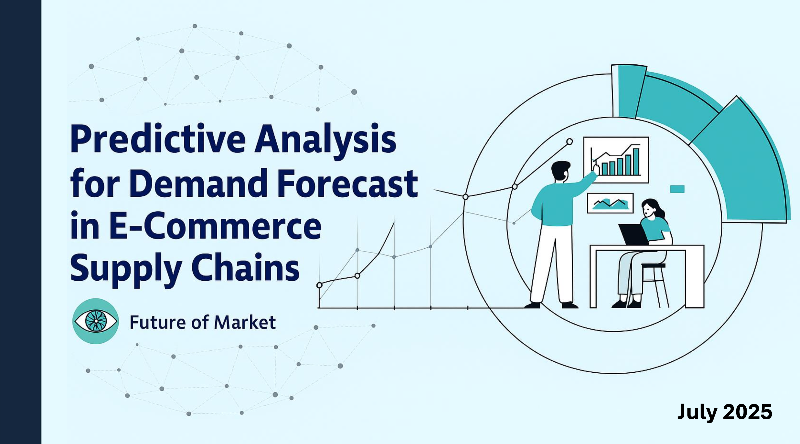
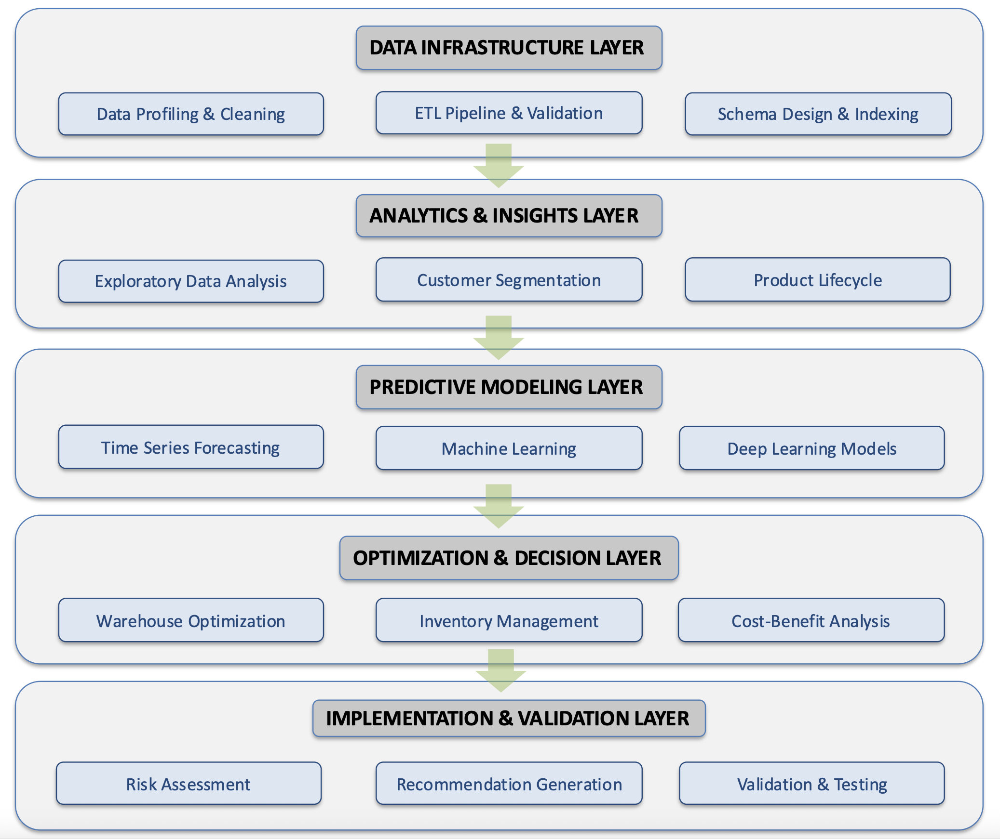

# Predictive Analysis for Demand Forecast in E-Commerce Supply Chains




## 🧩 Project Overview

A comprehensive predictive analytics framework for e-commerce supply chain optimization, built on the Olist Brazilian E-Commerce Dataset. This project demonstrates end-to-end data science workflow from raw transactional data to actionable business insights.

---

## 🏆 Key Achievements

- 99.5% data quality coverage  
- 91.3% overall validation score  
- R² = 0.967 demand forecasting accuracy  
- 24.3% inventory turnover improvement  
- 22.7% delivery time reduction  
- 18.6% delivery cost reduction

---

## 🧱 Framework Architecture



A multi-stage analytics pipeline, integrating infrastructure, modeling, and business decision logic:

### 🗃️ Data Infrastructure Layer

- ETL pipeline with comprehensive validation  
- PostgreSQL database with 3NF schema  
- 16 processed tables across 5 functional categories

### 🔍 Analytics & Insights Layer

- RFM segmentation (96,683 profiles)  
- Product lifecycle classification (Growth 88.5%, etc.)  
- Holiday sensitivity analysis (+35% sales in holidays)

### 📊 Predictive Modeling Layer

- Ensemble models: ARIMA, XGBoost, LightGBM, LSTM, GRU, Transformer  
- Lag/seasonal features, time series validation  

### 🔧 Optimization & Decision Layer

- Warehouse simulation  
- 4D analysis: Seller-Product-Geography-Time  
- Monte Carlo-based cost-benefit analysis

### 🧪 Implementation & Validation Layer

- Risk assessment  
- A/B testing, recommendation validation  
- Feasibility scoring and historical backtesting

---

## 🗃️ Dataset Information

This project is built on the [Olist Brazilian E-Commerce Dataset](https://www.kaggle.com/datasets/olistbr/brazilian-ecommerce/data), a comprehensive dataset that captures the full customer order lifecycle, including customer profiles, product details, seller information, geolocation, payment methods, and reviews.

### Dataset Overview

- Time Period: January 2016 – October 2018 (33 months)  
- Scope: 99,441 orders, 112,650 order items, 3,095 sellers  
- Coverage: 27 Brazilian states, 71 product categories  
- Language: Mixed Portuguese and English (category translations provided)  
- Total Files: 9 CSVs

### Dataset Structure

| Filename                              | Description                                                                                             |
|---------------------------------------|---------------------------------------------------------------------------------------------------------|
| `olist_orders_dataset.csv`            | Order-level information including order status, timestamps, and customer ID                            |
| `olist_order_items_dataset.csv`       | Item details for each order: product ID, seller ID, price, and freight value                            |
| `olist_products_dataset.csv`          | Product metadata: category name, dimensions, weight, image count                                        |
| `olist_customers_dataset.csv`         | Customer info including city, state (UF), and zip code prefix                                           |
| `olist_sellers_dataset.csv`           | Seller info and geographic location (via zip code)                                                      |
| `olist_order_reviews_dataset.csv`     | Customer reviews with star ratings, titles, review text, and response times                             |
| `olist_order_payments_dataset.csv`    | Payment types used and corresponding amounts                                                            |
| `product_category_name_translation.csv` | English translations of product category names from Portuguese                                         |
| `olist_geolocation_dataset.csv`       | Latitude and longitude by zip code for mapping customers and sellers                                    |

> Dataset URL: [https://www.kaggle.com/datasets/olistbr/brazilian-ecommerce/data](https://www.kaggle.com/datasets/olistbr/brazilian-ecommerce/data)

---

## 🗂️ Project Structure

<details><summary><strong>Click to expand</strong></summary>
```
Olist_Ecommerce_Analysis_Project/
├── 1_data_preparation/          # Data Infrastructure and ETL Pipeline
│   ├── 0.data_exploration.py    # Initial data exploration and quality assessment
│   ├── 1.base_*.py              # Base table processing (customers, orders, products, etc.)
│   ├── 2.derived_*.py           # Derived tables (customer profiles, product lifecycle, etc.)
│   ├── 3.dim_*.py               # Dimension tables (date, location)
│   ├── 4.check_tables.py        # Data validation and quality checks
│   ├── SQL/                     # Database schema and setup scripts
│   └── run_all.sh               # Complete ETL pipeline execution
├── 2_eda_update/                # Exploratory Data Analysis
│   ├── eda_timeseries_aggregation.py      # Time series analysis
│   ├── product_performance_overview.py    # Product performance metrics
│   ├── sales_distribution_*.py            # Sales analysis by dimensions
│   └── weekend_holiday_*.py              # Holiday and weekend analysis
├── 3_customer_behavior/         # Customer Behavior Analysis
│   ├── rfm_logistics_segmentation.py     # RFM customer segmentation
│   ├── customer_lifecycle_classification.py # Customer lifecycle analysis
│   ├── product_preference_segmentation.py # Product preference analysis
│   ├── purchase_funnel_dropout_analysis.py # Purchase funnel analysis
│   └── final_customer_persona_table.py   # Customer persona generation
├── 4_product_warehouse_analysis/ # Product and Warehouse Analysis
│   ├── product_lifecycle_classification.py # Product lifecycle analysis
│   ├── product_sales_curve_analysis.py    # Sales curve modeling
│   ├── inventory_efficiency_analysis.py   # Inventory optimization
│   ├── stock_risk_detection.py           # Risk assessment
│   ├── warehouse_simulation.py           # Warehouse simulation models
│   └── inventory_policy_recommendation.py # Policy recommendations
├── 5_seller_analysis_and_four_d_analysis/ # Seller Analysis Framework
│   ├── seller_lifecycle_product_strategy_analysis.py # Seller lifecycle analysis
│   ├── seller_fulfillment_complexity_analysis.py     # Fulfillment complexity
│   ├── seller_warehouse_demand_analysis.py          # Warehouse demand analysis
│   ├── regional_fulfillment_load_projection.py      # Regional load projection
│   └── seller_product_geography_time_analysis.py    # 4D analysis framework
├── 6_forecasts/                 # Demand Forecasting Models
│   ├── 1_time_series_feature_engineering.py # Feature engineering
│   ├── 2.1_statistical_forecasting.py      # Statistical models (ARIMA, etc.)
│   ├── 2.2_ml_forecasting.py              # Machine learning models
│   ├── 2.3_dl_forecasting.py              # Deep learning models (LSTM, GRU)
│   ├── 2.4_model_ensemble.py              # Ensemble forecasting
│   ├── 3.1_basic_capacity_calculation.py  # Capacity planning
│   └── multi_level_demand_forecasting.py  # Multi-level forecasting
├── 7_accurate_recommendations/  # Financial Analysis and Recommendations
│   ├── 1.1_cost_benefit_analysis_engine.py # Cost-benefit analysis
│   ├── 2.1_risk_assessment_mitigation.py  # Risk assessment
│   ├── 3.1_precision_recommendation_generator.py # Recommendation generation
│   ├── 4.1_recommendation_validation_optimization.py # Validation framework
│   └── run_week7_main.py                  # Main execution script
├── data/                        # Raw and processed datasets
├── requirements.txt              
└── README.md                    
```
</details>

## 🛠️ Technology Stack

- Programming: Python 3.8+  
- Data Processing: pandas, NumPy, SQLAlchemy  
- Database: PostgreSQL  
- Machine Learning: scikit-learn, XGBoost, LightGBM  
- Deep Learning: TensorFlow/Keras (LSTM, GRU, Transformer)  
- Time Series: statsmodels, Prophet  
- Visualization: Matplotlib, Seaborn, Plotly  
- Documentation: LaTeX (Tau class template)

---

## 🚀 Installation & Setup

### Prerequisites

- Python 3.8+  
- PostgreSQL 12+  
- Required packages listed in `requirements.txt`

### Quick Start

```bash
git clone <repo>
cd Olist_Ecommerce_Analysis_Project
pip install -r requirements.txt
cd 1_data_preparation && bash run_all.sh
